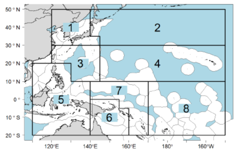

## Model Areas

The model used for the evaluations has eight areas as seen here:

## Performance Indicators

There are six main PIs included in PIMPLE.
Their numbers relate to their position in the original table of indicators. These numbers have been kept for convenience.

Additional PIs have also been included following requests from members.

The average values of the PIs are calculated over three time periods:

* Short-term: 2022-2030
* Medium-term: 2031-2039
* Long-term: 2040-2048

Some of the indicators are calculated over different model areas, or only calculated for certain subsets of fisheries and areas.

### 1. Probability of SB/SBF=0 being above the Limit Reference Point (LRP)

This indicator ranges between 0 and 1.
The higher the value, the smaller the chance of the stock falling below the LRP.
For example, a value of 1 means that there is no chance of falling below the LRP and a value of 0.9 means that there is a 1 in 10 (0.1) chance of falling below the LRP.

Higher values are preferred, depending on the level of risk that managers and stakeholders are prepared to accept.

It is a WCPFC requirement that the probability of being above the LRP is at least 0.8.

### 3. Catches

The catches are presented as relative to the average catches in the period 2013 to 2015.
They are calculated over several groupings, based on area and fishery:

* Total catch over all areas and fisheries
* Purse seine catches in areas 6, 7 and 8
* Catches from all fisheries in individual areas

### 4. Relative Catch per Unit Effort (CPUE)

The CPUE is calculated for:

* Pole and line fisheries in ares 1-4
* Purse seine fisheries in areas 6, 7 and 8 (excluding the associated purse seines in area 6).

The CPUE is presented as relative to the respective reference periods for those fisheries (2001-2004 average for pole and line; 2012 for purse seine).

### 6. Catch stability

Catch stability measures how variable catches are in time. 
The indicator ranges between 0 and 1. A value of 1 means that the catches do not change over time, i.e. they are constant.
A value of 0 means that the catches vary relatively strongly over time, compared to the other HCRs.

The indicator has been calculated over the same groupings as described for PI 3 (catches).
However, note that although the stability of catches can be compared across time different periods and HCRs, it cannot be compared between area groupings. 
For example, you cannot compare the stabilities in area 1 to the stabilities in area 2.

This indicator has also been calculated as the variability of relative catches (catches relative to the average catches in the period 2013 to 2015) over time.
The higher the variability, the more the catches change over time.
A variability of 0 means that the catches are not changing over time.

### 7. Effort stability

This is similar to PI 6 (catch stability).
It measures the stability of effort for the fisheries managed through effort limits.
It is also possible to investigate the variability, as well as the stability.

The indicator ranges between 0 and 1. A value of 1 means that the effort does not change over time, i.e. it is constant.
A value of 0 means that the effort varies relatively strongly over time, compared to the other HCRs.

### 8. Proximity of SB/SBF=0 to the target SB/SBF=0

This indicator measures how close, on average, the SB/SBF=0 is to the target SB/SBF=0.
The higher the value of the indicator, the closer SB/SBF=0 was to this reference value in each year, on average.
A value of 1 means that the SB/SBF=0 was exactly at the reference value in each year.
A value of 0 means that the SB/SBF=0 was as far from the reference value as possible in each year.

Note that this indicator is different to comparing the average value of SB/SBF=0 to the reference value.
If the average value of SB/SBF=0 over a range of years is close to the reference value it does not necessarily mean that SB/SBF=0 was close to the reference value during those years.
For example, if SB/SBF=0 moved between 0.225 and 0.625 each year, the average value would be 0.425 but it would never have been very close to 0.425 in any year.

### Effort (relative to the reference period)

This indicator measures the effort of the effort-managed fisheries relative to their reference periods (2001-2004 average for pole and line; 2012 for purse seine).

This is effectively the same as the average output of the HCR in each time period.

### SB/SBF=0

SB/SBF=0 is the ratio of the adult biomass to the adult biomass in the absence of fishing (sometimes known as depletion).
The value ranges between 0 and 1.
SB/SBF=0 is a measure of stock status and can be compared to the Limit Reference Point (LRP) of 0.2 and the Target Reference Point (TRP).

### SB/SBF=0 relative to target

This indicator measures the SB/SBF=0 relative to the target.
A value of 1 means that the SB/SBF=0 is at the target value.

## Plot Types

There are four plot types available in PIMPLE: bar charts, box plots, time series plots and radar plots. Each of them displays the information in a different way.

          
